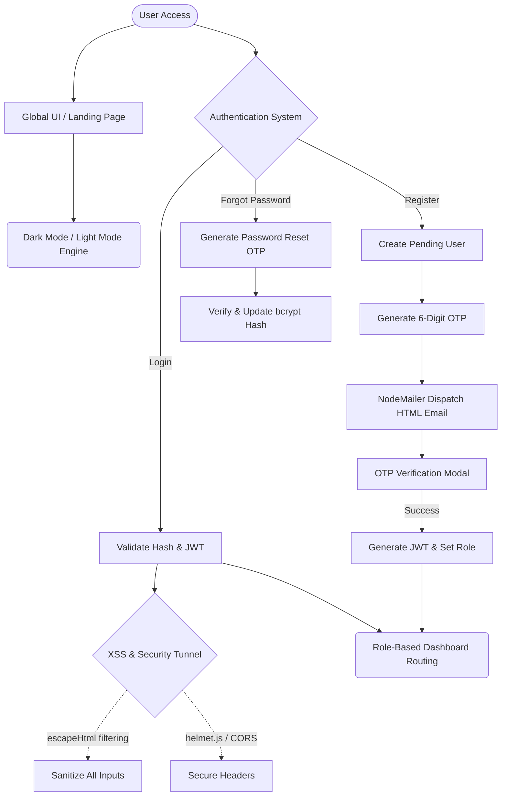
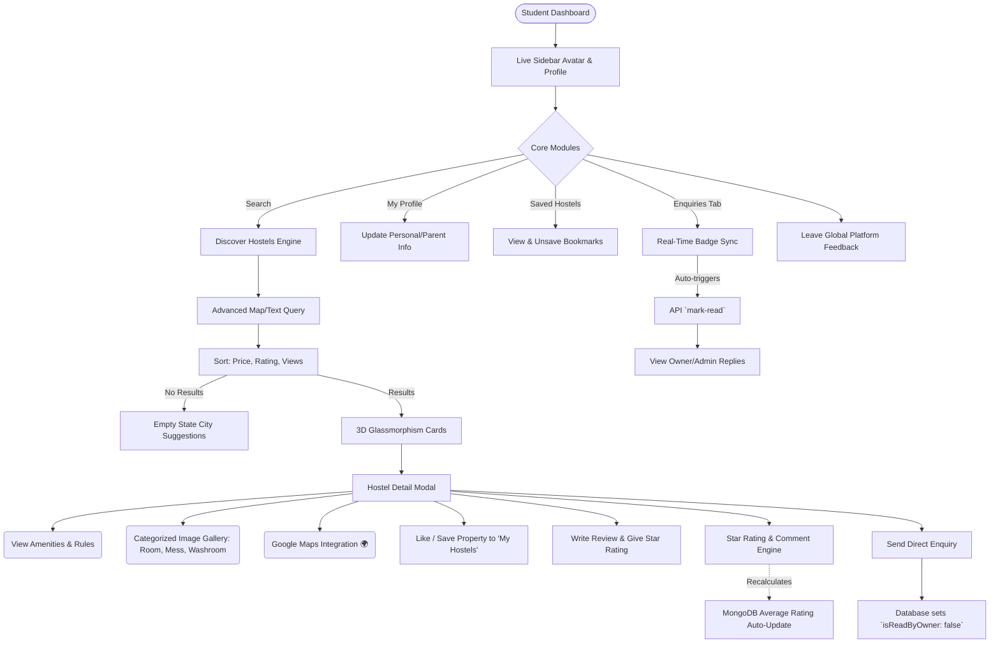
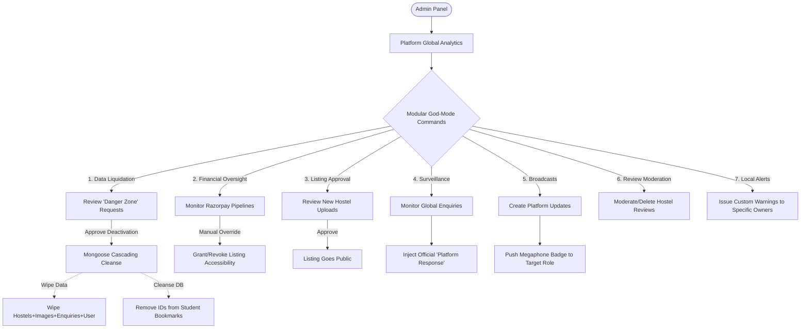
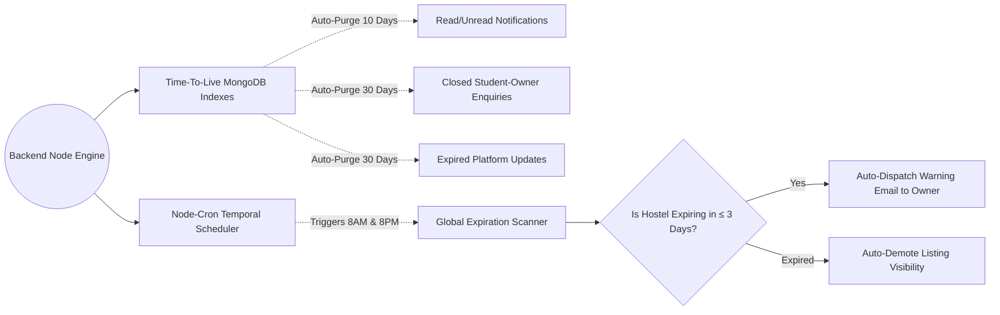

# 🏙️ Hostel Buddy — Complete Core Architecture & Flow Blueprint
> **Creator & Lead Developer:** Raunak Sharma  
> **Type:** Full-Stack Enterprise Architecture Document  

This blueprint outlines the exact end-to-end operational flow of every single module, database schema interaction, and feature built into the Hostel Buddy ecosystem. **Nothing has been left out.**

---

## 🔐 1. Global Infrastructure & Security Layer
*The foundational layer handling sessions, security, and global utilities across all roles.*


**Covered Features:** Global Theme Toggles, OTP Registration, Forgot Password Recovery, Email Dispatching, JWT Sessons, Password Encryption, Global XSS Protection, Tour.js User Onboarding.

---

## 🎒 2. Student Ecosystem (The Consumer Flow)
*End-to-end journey of a student discovering and interacting with properties.*


**Covered Features:** Advanced Sorting & Searching, Empty States, Glassmorphism UI, Save/Bookmark, Dynamic Ratings Calculation, Real-Time Badges, Full Photo Galleries, Feedback Engine, Profile Management, Atomic View Counting.

---

## 🏢 3. Owner Ecosystem (The Provider Flow)
*Property onboarding, Razorpay monetization, and bulk operational flows.*

```mermaid
flowchart TD
    O([Owner Dashboard]) --> A{KYC Verification Engine}
    A -->|Pending| B[Upload Aadhaar/Doc to Cloudinary]
    B --> C[Await Admin Approval]
    
    A -->|Verified| D[Dashboard KPIs & Revenue]
    
    D --> E{Property Management}
    E --> F[Add New Hostel]
    F --> G[Upload Parallel Images to Cloudinary]
    G --> H[Live Visual Progress Bar]
    H --> I[Listing Stored in Database]
    
    I --> J{Monetization Gateway}
    J --> K[Razorpay Subscription Prompt]
    K -->|Pay ₹259/mo| L[Signature Verification via crypto-hmac]
    L --> M[Listing Activated & Pending Admin Review]
    
    E --> N[View Live Expiry Dates]
    N -->|Dynamic Badges| O[Yellow: Expires Soon | Red: Expired]
    O --> P[1-Click Renew Button]
    
    D --> Q{Enquiry Management}
    Q --> R[Badge Driven Unread System]
    R -->|Open Tab| S[API `mark-read` clears badge]
    S --> T[Mass Operations: Bulk Delete 🗑️]
    S --> U[Granular: Reply to Student]
    U --> V[Backend sets `isReadByStudent: false`]
```
**Covered Features:** Aadhaar KYC Verification, Parallel Cloudinary Uploads with UI Progress, Razorpay ₹259/mo Gateway, Crypto-Signature Validation, Dynamic Expiration Badging, Bulk-Delete Enquiries, Live Responsive Chat Replier.

---

## 👑 4. Admin Ecosystem (The Controller Flow)
*System-wide God-Mode for managing users, finances, and data moderation.*


**Covered Features:** Comprehensive Cascade Deletions, Financial Real-Time Tracking, Manual Subscription Overrides, KYC Moderation, Listing Approval Pipeline, Global Enquiry Sniffing & Intervention, Platform-wide Updates Broadcast, Granular Target Notifications, Review Moderation.

---

## ⚙️ 5. Automated Background Workers (The Invisible Engine)
*Features that run automatically without human intervention to keep the system clean.*


**Covered Features:** MongoDB Native TTL Document Purging (Self-cleaning database), Node-Cron Automated Job Scheduling, Auto-Warning Dispatches, and Memory/Storage Optimization without external load.

---
> *Platform Architecture completely modeled and realized under the vision of **Raunak Sharma**.* 🚀
